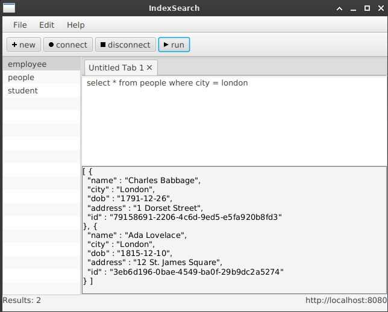

# IndexSearch

IndexSearch is a Spring Boot based application that implements an **Inverted Index** for efficient document searching. It includes a REST server and both CLI and GUI clients for creating, updating, deleting, and searching documents.

## Features

- **Inverted Indexing**: Fast full-text search capabilities.
- **REST API**: Simple interface for document management.
- **Persistence**: Persists data to the local disk (`data/` directory) to survive restarts.
- **Spring Boot**: Java 17, Spring Boot 2.7.x, JLine-based CLI, JavaFX GUI.

## Prerequisites

- **Java 17** or higher
- **Maven** 3.6+

## Build

   ```bash
mvn clean package
```

This produces:
- Server JAR: `target/indexsearch-server-0.0.1-SNAPSHOT.jar`
- Client JAR: `target/indexsearch-client-0.0.1-SNAPSHOT.jar`

## Run the Server

The server starts on `http://localhost:8080` by default.

```bash
./script/server.sh
```

Or run the JAR directly:

```bash
java -jar target/indexsearch-server-0.0.1-SNAPSHOT.jar --spring.profiles.active=server
```

Server data is stored under `data/`, `metadata/`, and `index/` in the project root.

## Run the Client (CLI)

```bash
./script/client-cli.sh
```

Or run the JAR directly:

```bash
java -Dspring.profiles.active=client \
  -Dapplication.client.mode=cli \
  -jar target/indexsearch-client-0.0.1-SNAPSHOT.jar
```

CLI commands:
```
create-collection <mapping-json|@file>
list-collections
delete-collection <collection>
add-doc <collection> <document-json|@file>
update-doc <collection> <docId> <document-json|@file>
get-doc <collection> <docId>
delete-doc <collection> <docId>
search <collection> <query>
sql <sql-query>
rebuild-index <collection>
```

## Run the Client (GUI)

The GUI uses JavaFX 21 and reads the same server URL setting. It does not
connect automatically; click **connect** to load collections.

```bash
./script/client-gui.sh
```
Or run the JAR directly:

```bash
java -Dspring.profiles.active=client \
  -Dapplication.client.mode=gui \
  -jar target/indexsearch-client-0.0.1-SNAPSHOT.jar
```



The client talks to the server at `http://localhost:8080` by default. 
Override with `-Dindexsearch.server.url=...` if needed.

## APIs

Base URL: `http://localhost:8080/api`

### Collections
- `GET /collections` - list collections
- `POST /collections` - create collection from a mapping JSON
- `DELETE /collections/{name}` - delete a collection

Example:
```bash
curl -X POST "http://localhost:8080/api/collections" \
     -H "Content-Type: application/json" \
  -d '{"name":"books","keys":[{"field":"title"},{"field":"content"}]}'
```

### Documents
- `POST /collections/{collection}/documents` - create document
- `PUT /collections/{collection}/documents/{id}` - update document
- `GET /collections/{collection}/documents/{id}` - fetch document
- `DELETE /collections/{collection}/documents/{id}` - delete document

Example:
```bash
curl -X POST "http://localhost:8080/api/collections/books/documents" \
  -H "Content-Type: application/json" \
  -d '{"title":"My First Doc","content":"hello world search"}'
```

### Search
- `POST /collections/search?collection=NAME&query=TEXT` - simple search
- `POST /query` - SQL-like query; body `{"query":"..." }`

Notes:
- `SELECT * FROM collection` returns all documents up to 200 results.
- All search responses are capped at 200 documents by default.

Examples:
```bash
curl -X POST "http://localhost:8080/api/collections/search?collection=books&query=hello"
curl -X POST "http://localhost:8080/api/query" \
  -H "Content-Type: application/json" \
  -d '{"query":"SELECT * FROM books WHERE content = \"hello\""}'
```
